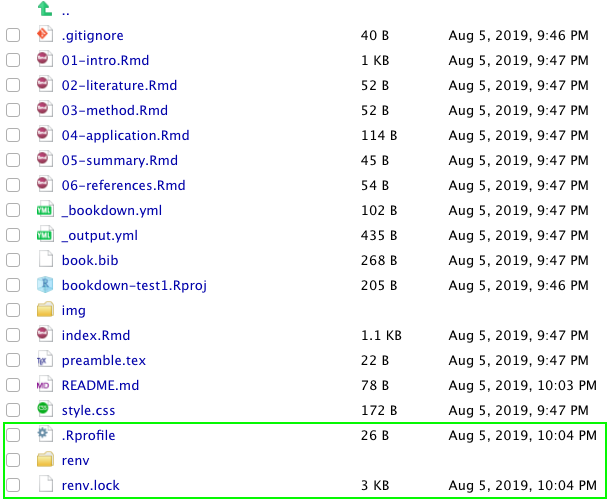
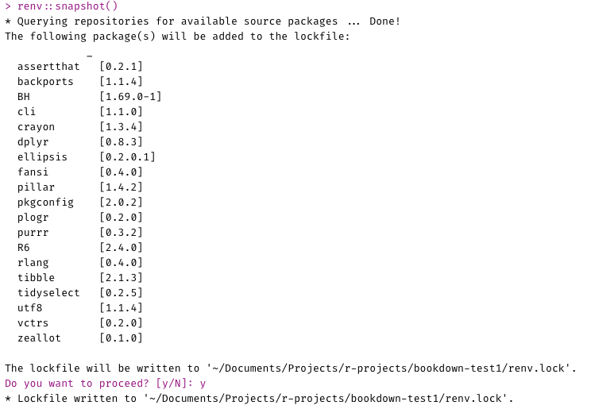

# bookdown-test1

### The original author/creator of the bookdown:

1. `bookdown:::bookdown_skeleton(getwd())`
1. `renv::init()`

    This adds three new files.
  
    ```{r echo = FALSE}
      
    ```
  
1. ...edit bookdown content... (added `library(dplyr)` to `01-intro.Rmd`)
1. `renv::snapshot()`

    Resulting output:
    
    ```{r echo = FALSE}
    
    ```
    
1. Upload `renv.lock` to GitHub, add `.Rprofile` and `renv/` to `.gitignore`


### The person who wants to render the bookdown locally but doesn't have all of the required packages installed (e.g. dplyr):

1. Fork and clone the original repo
1. Create a new RStudio Project linked to the forked repo
1. Open up the project


...what happens when they try to preview the bookdown as-is?

1. `renv::restore()`

...does this cause `dplyr` to be installed? Can they preview the bookdown now?


